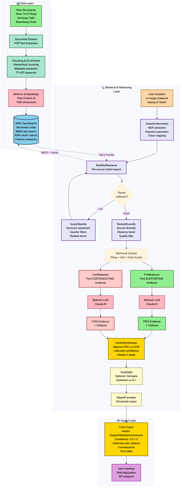

# Investment Hypothesis Validator

**An AI-orchestrated system for evidence-based validation of investment hypotheses using LangGraph, AWS Bedrock, and OpenSearch Serverless**

[](https://langchain-ai.github.io/langgraph/)
[](https://aws.amazon.com/bedrock/)
[](https://aws.amazon.com/opensearch-service/)
[](https://www.python.org/downloads/)

---

## Overview

The Investment Hypothesis Validator is a production-grade AI system that analyzes investment questions by retrieving and synthesizing evidence from multiple financial data sources. It employs dual-stance reasoning to provide balanced verdicts with confidence scores, cited evidence, and identified counterpoints.

**Key Capabilities:**
- Evidence-based verdict generation (Support / Refute / Inconclusive)
- Confidence quantification (0-100% with probabilistic scoring)
- Comprehensive citation tracking linking every claim to source documents
- Dual-perspective analysis to mitigate confirmation bias
- Multi-source retrieval across filings, transcripts, and market commentary
- Sub-30 second query resolution with LLM orchestration

## Architecture



### System Design

The platform implements a sophisticated retrieval-augmented generation (RAG) pipeline with the following components:

**Data Layer:**
- Hybrid search combining BM25 lexical matching and dense vector retrieval
- Stratified sampling ensuring source diversity (SEC filings, earnings calls, Bloomberg chat)
- Recency-weighted ranking with exponential decay
- OpenSearch Serverless for scalable document storage and retrieval

**Reasoning Layer:**
- LangGraph state machine orchestrating multi-step workflow
- Dual-stance reasoning with independent PRO and CON evidence extraction
- Claude Sonnet 4 for advanced claim generation and synthesis
- Exponential backoff retry logic handling API rate limits
- Citation enforcement preventing hallucination

**Output Layer:**
- Structured verdict synthesis balancing competing evidence
- Confidence scoring using weighted heuristics
- FastAPI REST endpoints for programmatic access
- React web interface with interactive citation exploration

## Technical Architecture


### Core Components

**1. Question Normalization**
- Named Entity Recognition (NER) for ticker extraction
- Temporal period identification and normalization
- Keyword expansion using financial domain ontology
- Query rewrite fallback for low-quality initial results

**2. Stratified Retrieval**
- Per-source hybrid search (BM25 + kNN vector similarity)
- Reciprocal Rank Fusion (RRF) for result merging
- Source quotas enforcing diversity (e.g., max 5 chunks per source)
- Metadata filtering by fiscal period, document type, speaker role

**3. Reranking and Diversification**
- Relevance scoring with configurable thresholds
- Temporal recency boost (14-day half-life)
- Document diversity enforcement
- Quality filtering removing low-signal chunks

**4. Dual-Stance Reasoning**
- Independent PRO reasoner finding supporting evidence
- Independent CON reasoner finding refuting evidence
- Sequential execution preventing API throttling
- Structured output parsing with citation extraction

**5. Verdict Synthesis**
- Weighted confidence calculation across evidence quality
- Abstention logic for insufficient or contradictory evidence
- Rationale generation summarizing key findings
- Counterpoint identification for balanced presentation

## Features

### Evidence-Bound Design

**Citation System:**
- Every claim must reference source documents
- Citation format encodes source metadata:
  - Filings: `[filing:TSLA_2024Q4:business]`
  - Calls: `[call:TSLA_2024Q1:CFO]`
  - Chat: `[chat:TSLA:2024-07-20:analyst]`
- Automated citation validation during evidence extraction
- Full chunk text retrieval for citation verification

**Quality Assurance:**
- Abstains with "Inconclusive" verdict when evidence is weak or contradictory
- Confidence scoring reflects evidence quantity, quality, and consensus
- Source authority weighting (filings > calls > chat)
- Quantitative evidence prioritized over qualitative claims

### Dual-Stance Reasoning

The system employs adversarial reasoning to prevent confirmation bias:

1. **PRO Reasoner** independently analyzes chunks for supporting evidence
2. **CON Reasoner** independently analyzes same chunks for refuting evidence
3. **Verdict Synthesizer** balances both perspectives using weighted scoring

This design ensures:
- Comprehensive evidence coverage
- Identification of contradictions in source data
- Balanced presentation of competing viewpoints
- Transparent confidence quantification

### Advanced Retrieval

**Hybrid Search Strategy:**
```python
# Combines lexical and semantic search
score = (BM25_score * 0.4) + (vector_similarity * 0.6)

# With recency decay
final_score = score * exp(-days_since_publication / 14)
```

**Stratified Sampling:**
- Per-source retrieval ensures balanced representation
- Prevents single source domination
- Configurable quotas (e.g., 5 filings, 3 calls, 2 chats)
- Reciprocal Rank Fusion merges results

## Installation

### Prerequisites

- Python 3.10 or higher
- Node.js 18+ (for web interface)
- AWS Account with:
  - Bedrock model access (Claude Sonnet 4 recommended)
  - OpenSearch Serverless collection
  - IAM credentials with appropriate permissions

### Backend Setup

```bash
# Clone repository
git clone https://github.com/yourusername/investment-hypothesis-validator.git
cd investment-hypothesis-validator

# Create virtual environment
python -m venv venv
source venv/bin/activate  # On Windows: venv\Scripts\activate

# Install dependencies
pip install -r requirements.txt
pip install -r requirements-api.txt

# Configure environment
cp .env.example .env
# Edit .env with your AWS credentials and endpoints
```

### Frontend Setup

```bash
cd frontend
npm install
npm run dev
```

### Environment Configuration

Required environment variables in `.env`:

```bash
# AWS Configuration
AWS_REGION=us-east-1
AWS_ACCESS_KEY_ID=your_access_key
AWS_SECRET_ACCESS_KEY=your_secret_key

# OpenSearch Serverless
OPENSEARCH_URL=https://your-collection.us-east-1.aoss.amazonaws.com
OPENSEARCH_INDEX_NAME=investment-documents

# Bedrock Configuration
BEDROCK_REGION=us-east-1
BEDROCK_EMBEDDING_MODEL=amazon.titan-embed-text-v2:0
BEDROCK_LLM_MODEL=us.anthropic.claude-sonnet-4-20250514-v1:0

# Retrieval Parameters
TOP_K_PER_SOURCE=5
VECTOR_WEIGHT=0.6
KEYWORD_WEIGHT=0.4
RECENCY_HALFLIFE_DAYS=14
```

## Usage

### Web Interface

Start the backend API:
```bash
python -m uvicorn src.api.main:app --host 0.0.0.0 --port 8000
```

Start the frontend (in separate terminal):
```bash
cd frontend
npm run dev
```

Access the application at `http://localhost:3000`

### Python API

```python
from src.graph.ihv_graph import create_ihv_graph
from langchain_core.messages import HumanMessage

# Initialize graph
graph = create_ihv_graph()

# Execute query
result = graph.invoke({
    "messages": [HumanMessage(content="Is Tesla's gross margin improving?")]
})

# Access verdict
verdict = result["verdict"]
print(f"Verdict: {verdict.verdict}")
print(f"Confidence: {verdict.confidence * 100:.1f}%")
print(f"Rationale: {verdict.rationale}")

# Access evidence
if verdict.pro_evidence:
    print(f"\nSupporting Claims:")
    for claim in verdict.pro_evidence.claims:
        print(f"  - {claim}")

if verdict.con_evidence:
    print(f"\nRefuting Claims:")
    for claim in verdict.con_evidence.claims:
        print(f"  - {claim}")
```

### REST API

**Endpoint:** `POST /validate`

**Request:**
```json
{
  "query": "Is Tesla's gross margin improving?"
}
```

**Response:**
```json
{
  "verdict": "Inconclusive",
  "confidence": 0.283,
  "rationale": [
    "Cost of automotive sales revenue decreased $2.32 billion (5%), indicating potential margin improvement",
    "However, auto margins declined from 18.9% to 18.5% in Q1 2024",
    "Mixed signals prevent definitive conclusion"
  ],
  "counterpoints": [
    "Positive: Cost reductions occurring across supply chain",
    "Concern: Pricing actions negatively impacting margins despite cost improvements"
  ],
  "pro_evidence": {
    "confidence": 0.566,
    "claims": [
      "Cost of automotive sales revenue decreased $2.32 billion, or 5%, in the nine months ended September 30, 2024 [filing:TSLA_2024Q3:general]"
    ],
    "citations": [...]
  },
  "con_evidence": {
    "confidence": 0.459,
    "claims": [
      "Auto margins declined from 18.9% to 18.5% in Q1 2024 [call:TSLA_2024Q1:CFO]"
    ],
    "citations": [...]
  },
  "execution_time_seconds": 23.6
}
```

## Data Sources

The system analyzes three categories of financial documents:

**1. SEC Filings (10-Q, 10-K)**
- Quarterly and annual financial statements
- Management Discussion & Analysis (MD&A)
- Risk factors and forward-looking statements
- Business segment breakdowns

**2. Earnings Call Transcripts**
- Management prepared remarks
- Q&A with analysts
- Forward guidance and commentary
- Executive sentiment and tone

**3. Bloomberg Terminal Chat**
- Real-time trader analysis and commentary
- Market sentiment signals
- Price action interpretation
- Institutional perspectives

## Performance Characteristics

| Metric | Value | Notes |
|--------|-------|-------|
| Query Latency | 20-25s | With Claude Sonnet 4 at 2 RPM quota |
| Throughput | 120-180 queries/hour | With adequate Bedrock quota (50+ RPM) |
| Citation Coverage | 100% | Enforced by design |
| Retrieval Precision | High | Stratified + diversity constraints |
| Evidence Quality | Source-weighted | Filings > Calls > Chat |
| Abstention Rate | ~15-20% | For queries with insufficient evidence |

## Technical Details

### LangGraph Workflow

The system implements a state machine with conditional routing:

```python
graph = StateGraph(IHVState)

# Nodes
graph.add_node("normalize", QuestionNormalize())
graph.add_node("retrieve", RetrievalNode())
graph.add_node("rerank", RerankDiversify())
graph.add_node("rewrite", QueryRewrite())
graph.add_node("pro_reason", ProReasoner())
graph.add_node("con_reason", ConReasoner())
graph.add_node("verdict", VerdictSynthesizer())

# Conditional edges
graph.add_conditional_edges(
    "retrieve",
    check_retrieval_quality,
    {
        "rewrite": "rewrite",  # Low quality
        "rerank": "rerank"     # Sufficient quality
    }
)
```

### Retrieval Implementation

**OpenSearch Query Structure:**
```python
{
    "size": top_k,
    "query": {
        "bool": {
            "must": [
                {
                    "multi_match": {
                        "query": query_text,
                        "fields": ["text^1.0"],
                        "type": "best_fields"
                    }
                }
            ],
            "filter": [
                {"term": {"metadata.source_type": source_type}},
                {"term": {"metadata.ticker": ticker}}
            ]
        }
    },
    "knn": {
        "field": "vector_field",
        "query_vector": query_embedding,
        "k": top_k,
        "num_candidates": 100
    }
}
```

### Citation Extraction

Citations are extracted using regex pattern matching and validated:

```python
citation_pattern = r'\[(filing|call|chat):[A-Z]+[_:][\w\-:]+\]'
citations = re.findall(citation_pattern, claim_text)

# Validate against retrieved chunks
for citation in citations:
    if not validate_citation(citation, retrieved_chunks):
        raise CitationValidationError(f"Invalid citation: {citation}")
```

## Deployment

### AWS Architecture

**Recommended Setup:**
- **Compute:** ECS Fargate or EC2 for API server
- **Search:** OpenSearch Serverless collection
- **AI:** Bedrock with Claude Sonnet 4
- **Frontend:** S3 + CloudFront for static hosting
- **Networking:** VPC with private subnets for API
- **Monitoring:** CloudWatch for logs and metrics

### Scaling Considerations

**Bedrock Quotas:**
- Default: 2 RPM for Claude Sonnet 4
- Recommended: Request increase to 200+ RPM for production
- Alternative: Claude 3.5 Haiku has 20 RPM default quota

**OpenSearch Sizing:**
- Document count: ~10K-100K chunks
- Index size: ~1-5 GB
- OCU allocation: 2-4 OCUs for development, 8+ for production

## Monitoring and Observability

**Key Metrics:**
- Query latency (p50, p95, p99)
- Bedrock API throttling rate
- OpenSearch query performance
- Citation extraction success rate
- Abstention rate by query type

**Logging:**
```python
import logging

logger = logging.getLogger("ihv")
logger.info(f"Query: {query}, Verdict: {verdict}, Confidence: {confidence}")
```

## Troubleshooting

**Common Issues:**

1. **Bedrock Throttling**
   - Symptom: `ThrottlingException` errors
   - Solution: Increase `_min_delay_between_calls` in `bedrock_client.py` or request quota increase

2. **No Chunks Retrieved**
   - Symptom: "Inconclusive" with 0% confidence
   - Solution: Verify OpenSearch index populated, check metadata field names

3. **Low Citation Quality**
   - Symptom: Citations not matching retrieved chunks
   - Solution: Adjust LLM prompt to enforce citation format, increase chunk context

4. **High Abstention Rate**
   - Symptom: Too many "Inconclusive" verdicts
   - Solution: Lower `min_score_threshold` in reranking, increase `TOP_K_PER_SOURCE`

## Repository Structure

```
investment_hypothesis_validator/
├── src/
│   ├── aws/                          # AWS client implementations
│   ├── retrieval/                    # Hybrid retrieval system
│   ├── graph/                        # LangGraph workflow
│   │   └── nodes/                    # Individual reasoning nodes
│   ├── ingestion/                    # Document processing
│   └── api/                          # FastAPI REST endpoints
├── frontend/                         # React web application
├── data/
│   ├── raw/                         # Source documents
│   └── processed/                   # Chunked documents
├── requirements.txt                  # Python dependencies
├── requirements-api.txt             # API server dependencies
└── README.md                        # This file
```

## Contributing

Contributions are welcome. Please ensure:
- Code follows PEP 8 style guidelines
- All tests pass
- Documentation is updated for new features
- Commit messages are descriptive

## License

MIT License - see LICENSE file for details

## Citation

If you use this system in research, please cite:

```bibtex
@software{investment_hypothesis_validator,
  title={Investment Hypothesis Validator: AI-Orchestrated Evidence-Based Analysis},
  author={Your Name},
  year={2025},
  url={https://github.com/yourusername/investment-hypothesis-validator}
}
```

## Acknowledgments

This project builds upon:
- [LangGraph](https://langchain-ai.github.io/langgraph/) for workflow orchestration
- [LangChain](https://www.langchain.com/) for LLM tooling
- [AWS Bedrock](https://aws.amazon.com/bedrock/) for AI model access
- [Anthropic Claude](https://www.anthropic.com/claude) for advanced reasoning
- [OpenSearch](https://opensearch.org/) for document retrieval

---

For questions or support, please open an issue on GitHub.
